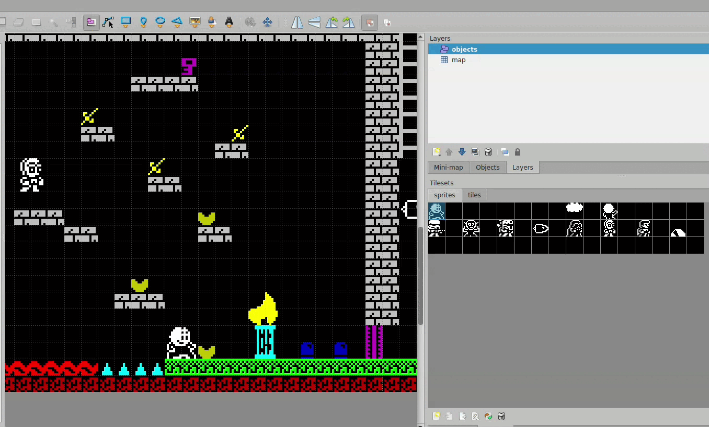

# ZX Spectrum Game Maker - Release Notes

_De 2025-09-15 a 2026-01-07_

---

## 2025-09-15
### Nuevas funcionalidades
- Pantalla inicial configurable (modo Arcade).
- Timer que quita vida o finaliza el juego.
- Distintos objetivos de juego: recoger items, eliminar enemigos, o ambos.
- Puertas que se abren al recoger items.
- Tiles que se rompen al tocarlos.

[Ver video](https://www.youtube.com/embed/0s2WH1Wn-n4?si=gWO5vXlAqK2gfx57)

### Mejoras
- Actualización de librería GuSprites.
- Corrección de errores en conteo de items y limpieza de acoplamiento.

---

## 2025-10-19
### Nuevas funcionalidades
- Configurar tiempo de tiles que se rompen.
- Colisión pixel perfect opcional.
- Papel y tinta de mensajes por defecto.
- Plataformas mimetizadas y Hi Score mimetizado.
- Nuevas músicas (intro y objetivo arcade).
- Tile de ammo disponible para fondo.
- Flash opcional en mensajes.
- Reset de pantalla al morir (Arcade).
- Pantalla de recuento de puntos (Arcade).
- Sprite como objetivo (Arcade).
- Mostrar Current Stage en HUD.
- Hurry up: mensaje y música acelerada.
- Música por pantalla y mensajes personalizables.

### Mejoras
- Revisión de permisos, optimización de tiles animados, mimetización de objetos.
- Mejoras en animación jetpack, posición prota, cambio de música, optimización de código y HUD.
- Corrección de atributos de tile vacío.

---

## 2025-10-20
### Nueva funcionalidad
- Mejor integración con Tiled: propiedades automáticas, valores válidos, selección guiada de elementos.

[Ver video](https://www.youtube.com/embed/JcUgUJuwkUk?si=vsQ3seDWKHuQ7QKO)

### Mejoras
- Corrección de error en música de intro.

---

## 2025-10-22
### Mejor integración con Tiled II
- Usar sprite de prota para marcar posición inicial.
- Eliminación de sprites no seleccionables en el sprite set.
- Prevención de uso de sprites incorrectos (aviso y borrado).
- Alineado automático a rejilla aunque se intente desalinear.

Recomendación de la herramienta [Tiled](https://www.mapeditor.org/) y su [página en itch.io](https://thorbjorn.itch.io/tiled).

---

## 2026-01-07
### Funcionalidades
- Textos en pantalla en 3 idiomas, tamaño y posición configurables.
- Dash en el aire (impulso rápido).
- Wall Jump (salto en pared).
- Arma de corto alcance (ej. espada).
- Enemigos solo eliminables con arma corta.

[Ver video 1](https://www.youtube.com/embed/txZfJtzWNRQ?si=9WwVzP5Ep-05_6L4)
[Ver video 2](https://www.youtube.com/embed/zz_WrW2YMB8?si=wB6wgUwuwFttCuZi)

### Optimizaciones
- Optimización de memoria "contended" y uso dinámico de bancos.
- Arreglo de uso de password y optimización de espacio.
- Cambio a compilador ASM de Boriel.
- Mejora de estabilidad en MacOS (gracias a [BTCO](https://btco-original.itch.io/)).
- Mejora de animación en escaleras.
